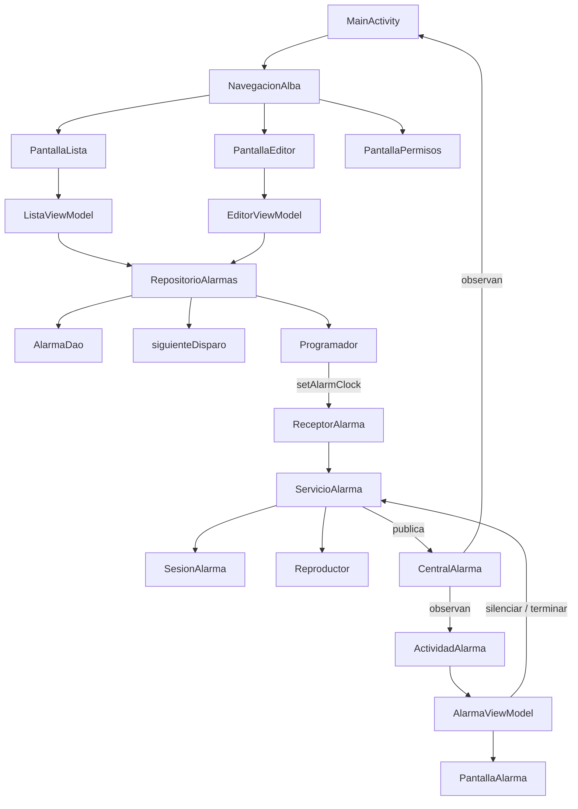

# Arquitectura

Volver al [[00 Indice]]. Todo cuelga de `app/src/main/java/com/oriol/alba/`.

## Quién usa a quién

## Carpetas

| Carpeta | Qué hay | Nota |
|---|---|---|
| raíz | `AlbaApp` (+ `Contenedor`), `MainActivity`, `Navigation.kt`, `NavigationKeys.kt` | [[ui - pantallas de la app]] |
| `alarma/` | Lo que hace sonar la alarma con Android: programador, receptores, servicio, sesión, reproductor, notificaciones, permisos | [[alarma - sistema]] |
| `datos/` | Room: entidad `Alarma`, enums `TipoTarea` y `Sonido`, DAO, `BaseDatos`, `RepositorioAlarmas` | [[datos]] |
| `dominio/` | Lógica pura sin Android: cuándo suena, días, elegir actividad, cálculo, foto | [[dominio]] |
| `premium/` | `Premium.activo` (provisional: siempre `true`) | [[Actividades#Premium]] |
| `theme/` | Paletas, tipografía y `TemaAlba` | [[Sistema de diseno]] |
| `ui/componentes/` | Piezas del sistema de diseño | [[Sistema de diseno]] |
| `ui/lista`, `ui/editor`, `ui/permisos` | Pantallas de la app con su ViewModel | [[ui - pantallas de la app]] |
| `ui/alarma/` | La actividad y la pantalla de la alarma, y los minijuegos | [[ui - pantalla de alarma]] |
| `ui/tareas/` | Estado (solo lógica) del cálculo y de los juegos, y la cámara con ML Kit | [[Actividades]] |

## Decisiones de estructura

- **Sin Hilt.** `AlbaApp.contenedor` (`Contenedor`) crea una vez `BaseDatos`, `ProgramadorSistema` y `RepositorioAlarmas`, y se pasan a mano. Los ViewModel de la app se crean en `Navigation.kt` con `viewModel { ... }`; el de la alarma, con `AlarmaViewModel.fabrica(app)`.
- **Un solo puente servicio → pantallas:** `CentralAlarma.sesion: StateFlow<EstadoSesion?>` (mismo proceso). `null` = no suena nada.
- **Pantallas → servicio:** Intents con acción (`ServicioAlarma.silenciar/terminar`), a través de la interfaz `AccionesAlarma`.
- **Todo se puede probar sin Android:** interfaces `Programador` (en pruebas, `ProgramadorFalso`), `SalidaSonido` (en el móvil, `Reproductor`) y `AccionesAlarma`; relojes inyectados (`reloj: () -> Long` / `() -> LocalDateTime`) y `Random` inyectado.
- **Patrón de pantalla:** `PantallaX(vm)` con estado → `X(...)` sin estado, que es lo que dibujan las capturas (`PantallaLista`→`ListaAlarmas`, `PantallaEditor`→`EditorAlarma`, `PantallaPermisos`→`ListaPermisos`).
- **Arranque directo (*direct boot*):** la BD vive en el almacenamiento protegido del dispositivo, y `ReceptorAlarma`, `ReceptorSistema`, `ServicioAlarma` y `ActividadAlarma` son `directBootAware`. Suena tras reiniciar sin desbloquear.

## Componentes del manifiesto (`app/src/main/AndroidManifest.xml`)

| Componente | Detalles |
|---|---|
| `.AlbaApp` | Application |
| `.MainActivity` | LAUNCHER |
| `.ui.alarma.ActividadAlarma` | `directBootAware`, `singleInstance`, `taskAffinity=""`, fuera de Recientes |
| `.alarma.ServicioAlarma` | `foregroundServiceType="mediaPlayback"`, `directBootAware` |
| `.alarma.ReceptorAlarma` | recibe `com.oriol.alba.DISPARAR` |
| `.alarma.ReceptorSistema` | BOOT_COMPLETED, LOCKED_BOOT_COMPLETED, MY_PACKAGE_REPLACED, TIME_SET, TIMEZONE_CHANGED, SCHEDULE_EXACT_ALARM_PERMISSION_STATE_CHANGED |

Permisos: ver [[alarma - sistema#Permisos]].
