# Capturas

Volver al [[00 Indice]]. Imágenes de `docs/capturas/`, generadas con `CapturasTest` ([[Pruebas#Capturas]]). Aquí se ven sin compilar nada (las rutas son relativas, así que también se ven en GitHub).

> [!note] Para Claude
> Abrir una imagen gasta bastantes tokens: ábrela solo si hace falta **ver** el diseño. Para saber qué hay en cada pantalla, basta con [[ui - pantallas de la app]] y [[ui - pantalla de alarma]].

## Versión 0.2: minijuegos (`docs/capturas/version02/`)

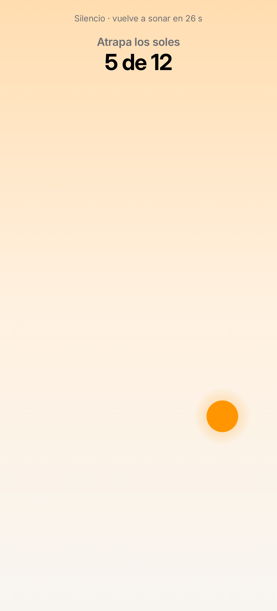 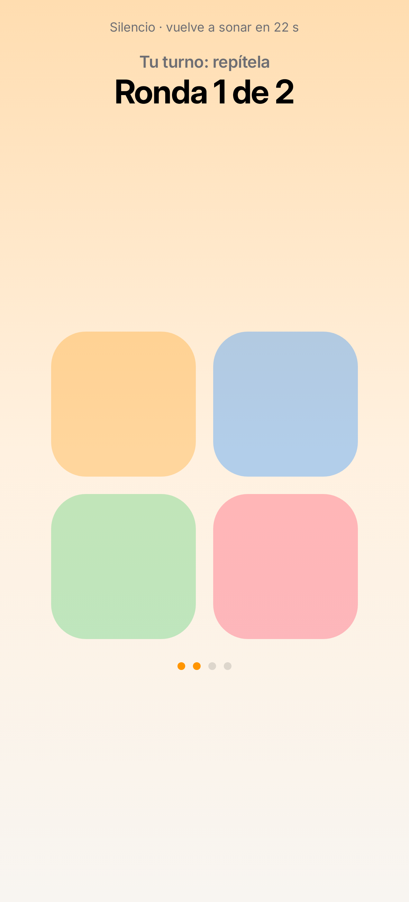 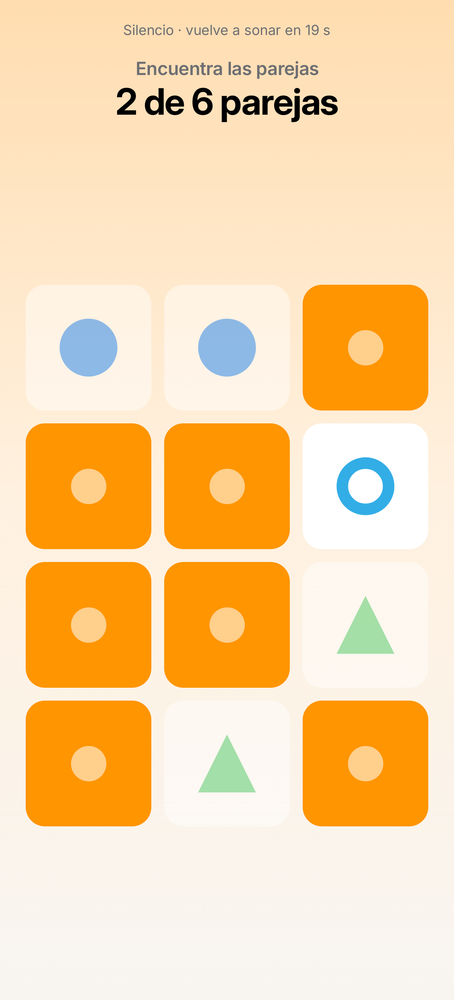 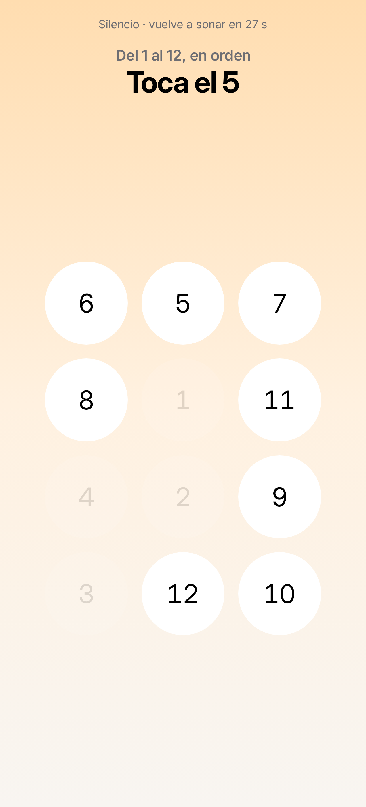 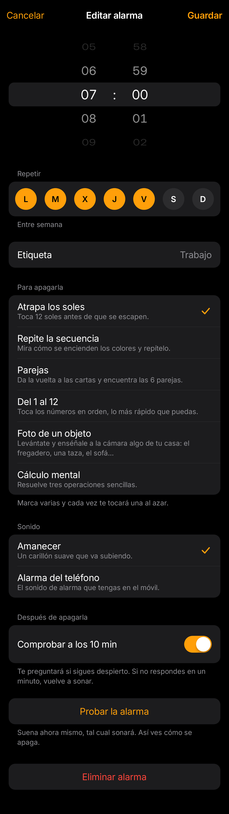

## Versión 0.1 (`docs/capturas/version01/`)

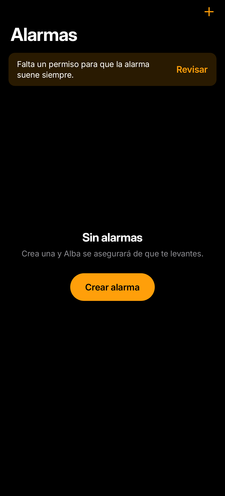  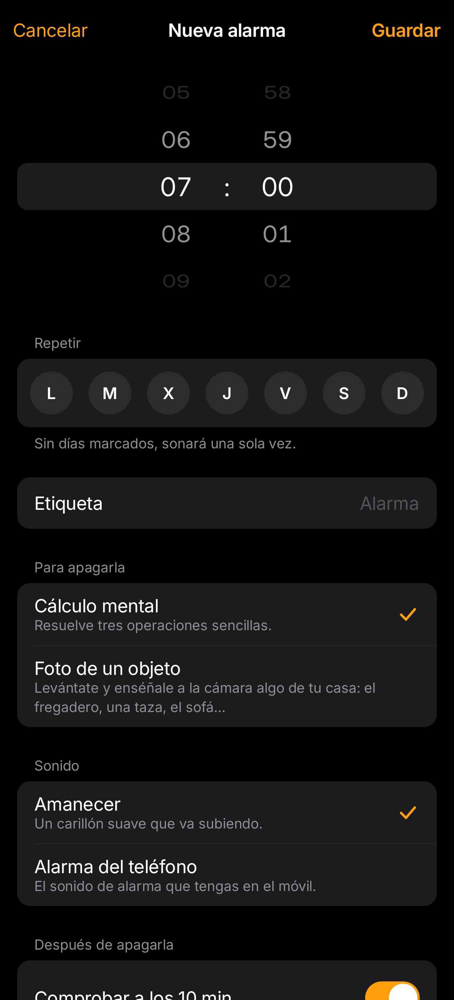 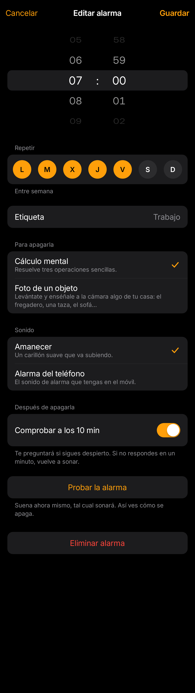 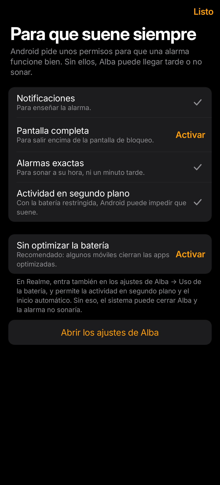

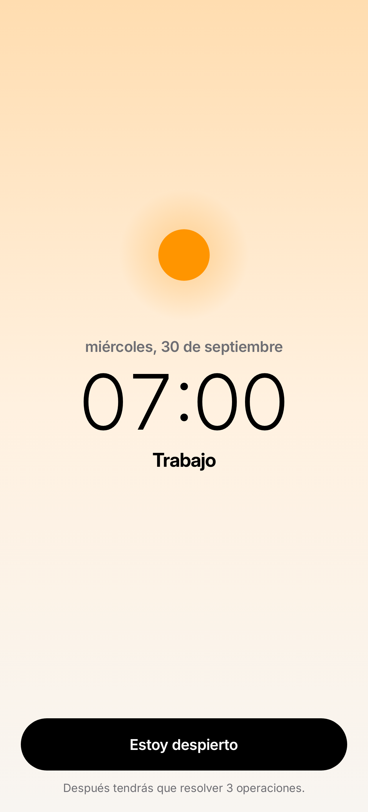 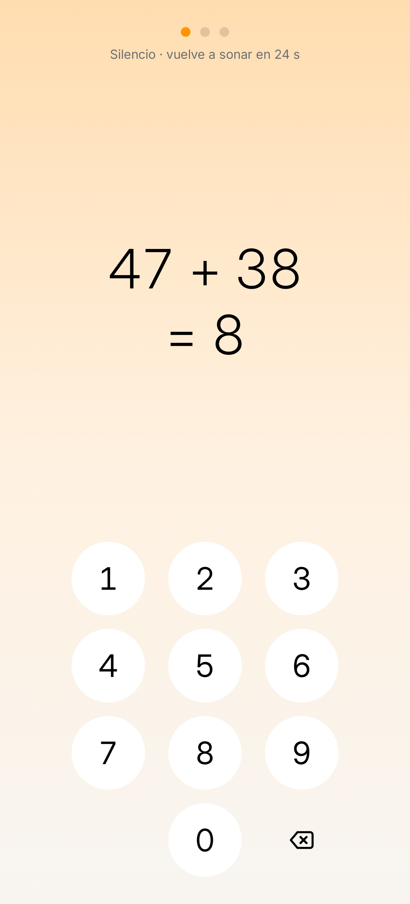 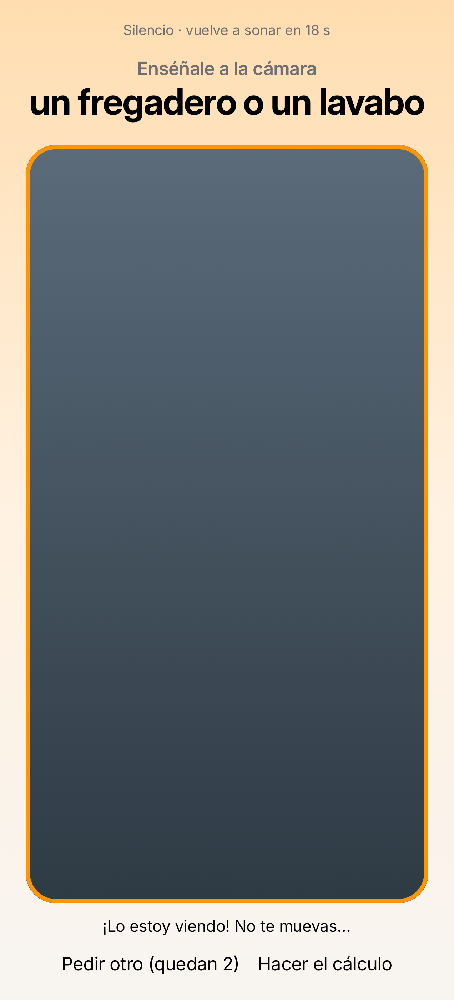 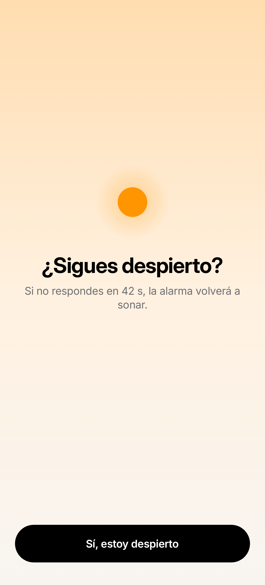 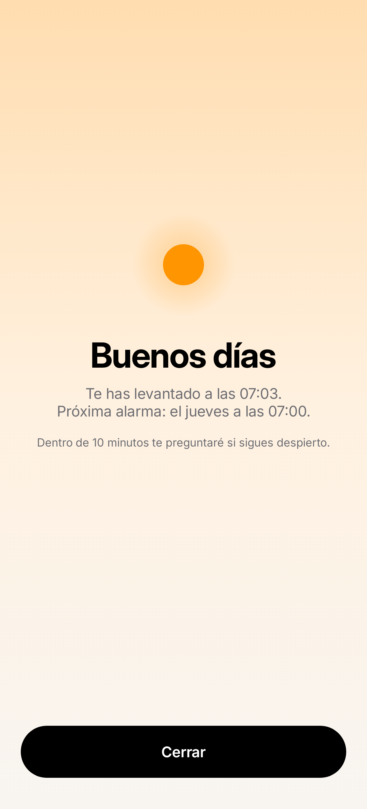

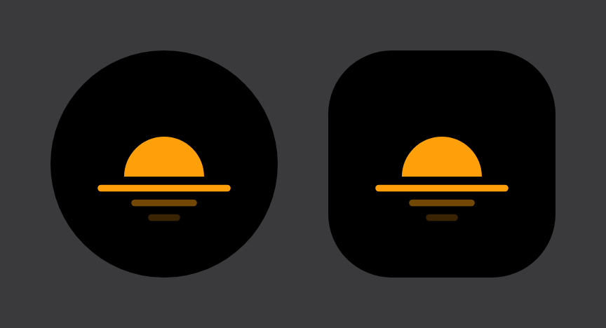

## Idiomas: en inglés (`docs/capturas/idiomas/`)

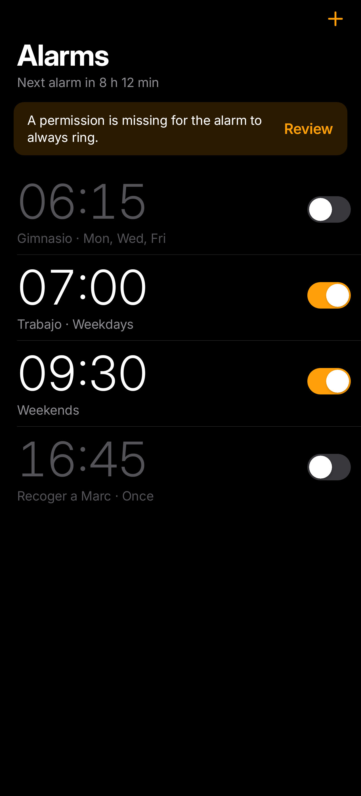 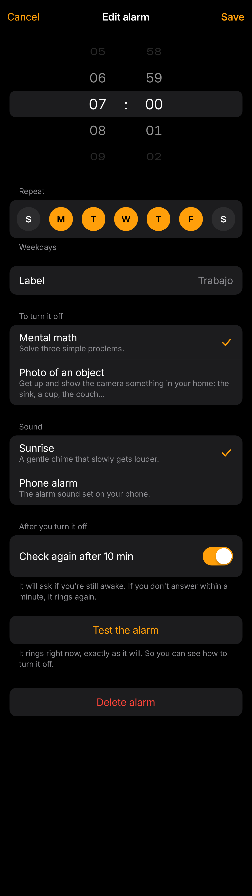 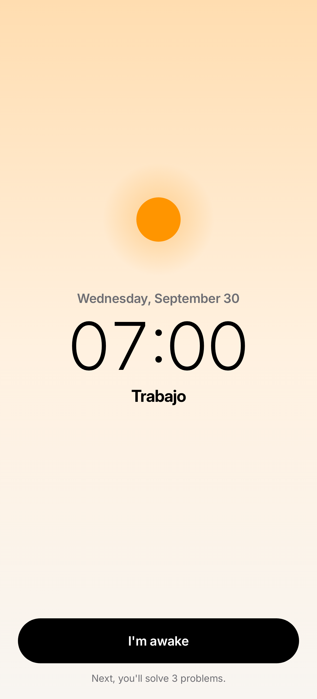 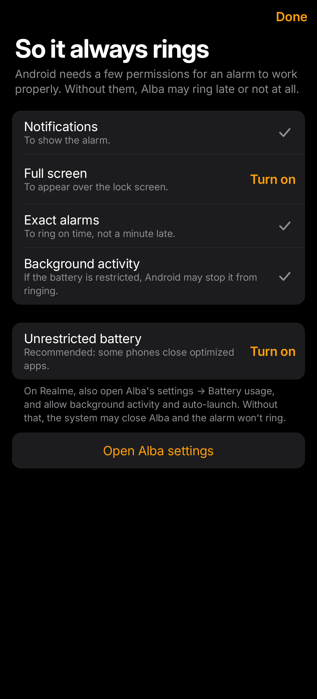

## Fase 1 (`docs/capturas/fase01/`)

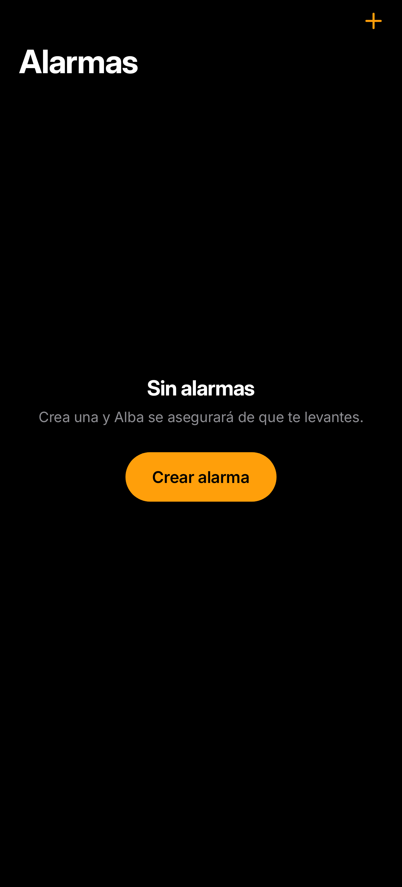 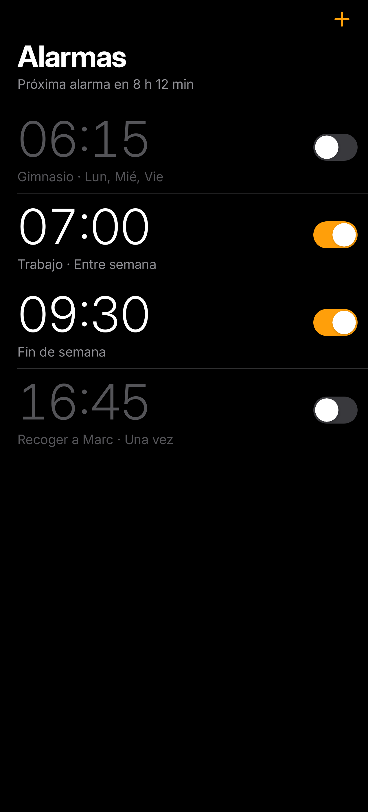 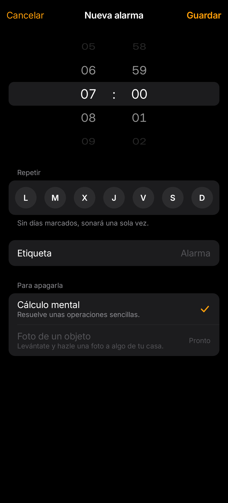 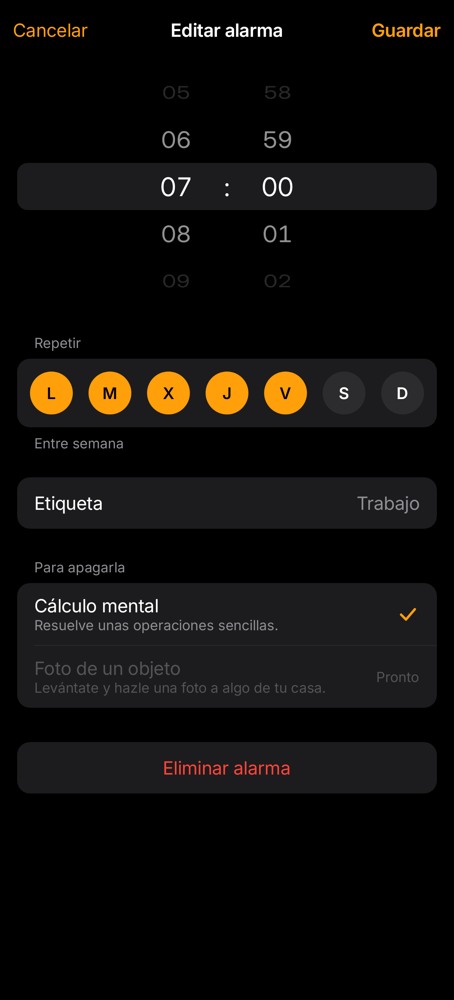 
