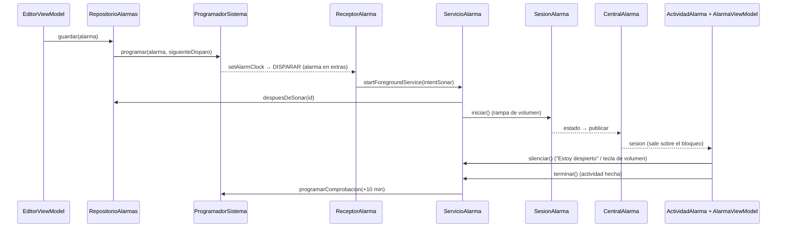

# Flujo de una alarma

Volver al [[00 Indice]]. El recorrido completo, con el archivo y el símbolo de cada paso.

## A. Programar

1. **Guardar** en el editor: `EditorViewModel.guardar()` → `RepositorioAlarmas.guardar()` → `dao.guardar` y `programar()` privado.
2. `programar()` calcula `siguienteDisparo(alarma, reloj())` (`dominio/Programacion.kt`). Si da `null` (desactivada), llama a `Programador.cancelar(id)`.
3. `ProgramadorSistema.programar` → `AlarmManager.setAlarmClock(AlarmClockInfo(millis, abrir MainActivity), disparo)`.
   - `disparo` = broadcast a `ReceptorAlarma`, acción `com.oriol.alba.DISPARAR`, data `alba://alarma/ID`, requestCode = id, extras `ponerAlarma` + `ponerModo(ALARMA)`.
   - Si salta `SecurityException` (sin permiso de alarmas exactas): `setAndAllowWhileIdle` (casi exacta).
4. **Reprogramar todas** (`repositorio.reprogramarTodas()`): `ReceptorSistema` (encendido, antes del desbloqueo, actualización, cambio de hora o de zona, permiso de exactas; con un límite de 8 s) y `MainActivity.onCreate`.

## B. Suena

5. `ReceptorAlarma.onReceive` → `leerAlarma()` / `leerModo()` → `startForegroundService(ServicioAlarma.intentSonar(...))`.
   - **Plan B** si falla: `Notificaciones.alarmaSinServicio` (pantalla completa con la alarma dentro). Luego `ActividadAlarma.arrancarSiHaceFalta` arranca el servicio con la pantalla ya visible.
6. `ServicioAlarma.onStartCommand(ACCION_SONAR)` → `sonar()`:
   1. `startForeground`, tipo mediaPlayback, con `Notificaciones.alarma(...)`: fija, `CATEGORY_ALARM` y *full-screen intent* a `ActividadAlarma`.
   2. Si no es prueba, el modo es ALARMA y el id ≠ 0: `repositorio.despuesDeSonar(id)`. Si se repite, programa la siguiente (desde ahora + 1 min); si era de una vez, la desactiva.
   3. Si ya hay una sesión sonando, se queda esa.
   4. En modo ALARMA: `programador.cancelarComprobacion()`.
   5. Crea `Reproductor` + `SesionAlarma` → `iniciar()`, recoge `estado` y lo publica en `CentralAlarma.publicar(estado)`.
7. `SesionAlarma.paso()` cada 100 ms: rampa de 0,15 a 1 en 45 s, vibración y parada sola a los 30 min. Valores en `SesionAlarma.Ajustes`.
8. `MainActivity` y `ActividadAlarma` observan `CentralAlarma.sesion`. `ActividadAlarma` sale sobre el bloqueo y llama a `vm.alCambiarSesion(sesion)` → `elegirTarea(alarma.tareas)` (una al azar para toda la sesión).

## C. Apagar

9. **"Estoy despierto"** o una **tecla de volumen** (`ActividadAlarma.onKeyDown`) → `AlarmaViewModel.despierto()` → `acciones.silenciar()` → `ServicioAlarma.silenciar(ctx)` → `ACCION_SILENCIAR` → `SesionAlarma.silenciar()`: 30 s de silencio y `fase = Tarea`. Cada toque en la actividad alarga el silencio. Al acabarse, vuelve a sonar con una rampa de 4 s.
10. **Actividad hecha** → `AlarmaViewModel.completar()` → `acciones.terminar()` → `ACCION_TERMINAR` → `SesionAlarma.terminar(completada = true)` → `Reproductor.detener()` → `ServicioAlarma.alTerminar()`:
    - `CentralAlarma.publicar(null)`.
    - Si se completó, el modo es ALARMA, `alarma.comprobar` está activo y no es prueba: `programarComprobacion(alarma, ahora + 10 min)`.
    - La pantalla pasa a `Fase.Hecho` ("Buenos días", la hora a la que te levantaste y la próxima alarma).

## D. "¿Sigues despierto?" (comprobación)

11. A los 10 min (`ServicioAlarma.MinutosComprobacion`) salta `ReceptorAlarma` en `Modo.COMPROBACION` (requestCode `Int.MAX_VALUE - 1`, data `alba://comprobacion`).
12. `SesionAlarma` en COMPROBACION suena suave (0,35). Si nadie responde en 60 s, pasa a ALARMA (rampa de 4 s) y el servicio cambia el texto de la notificación.
13. "Sí, estoy despierto" → `responderComprobacion()` → `completar(fueComprobacion = true)`. No se programa otra comprobación.

## E. Probar desde el editor

`ServicioAlarma.probar(ctx, alarma)` → `intentSonar(..., prueba = true)`. Suena igual, pero **no** llama a `despuesDeSonar` ni programa la comprobación.

## Si algo falla

| Fallo | Qué pasa | Dónde |
|---|---|---|
| Android no deja arrancar el servicio | Notificación a pantalla completa → la actividad arranca el servicio | `ReceptorAlarma`, `ActividadAlarma.arrancarSiHaceFalta` |
| `startForeground` falla | Igual que arriba | `ServicioAlarma.sonar` |
| Sin permiso de exactas | `setAndAllowWhileIdle` | `ProgramadorSistema.programarEn` |
| Falla el sonido del sistema | Usa `R.raw.amanecer` | `Reproductor.crear` |
| Volumen de alarma bajo | Lo sube al 80 % y luego lo devuelve | `Reproductor` (`init` / `detener`) |
| Android mata el servicio | `onDestroy` para el sonido y limpia `CentralAlarma` | `ServicioAlarma.onDestroy` |
| Sin cámara o la cámara falla | Otra actividad (`alternativaA`) | `TareaFoto`, `AlarmaViewModel.pasarAAlternativa` |
| La sesión acaba sin hacer la tarea | La actividad se cierra | `ActividadAlarma` (collect de `CentralAlarma`) |
